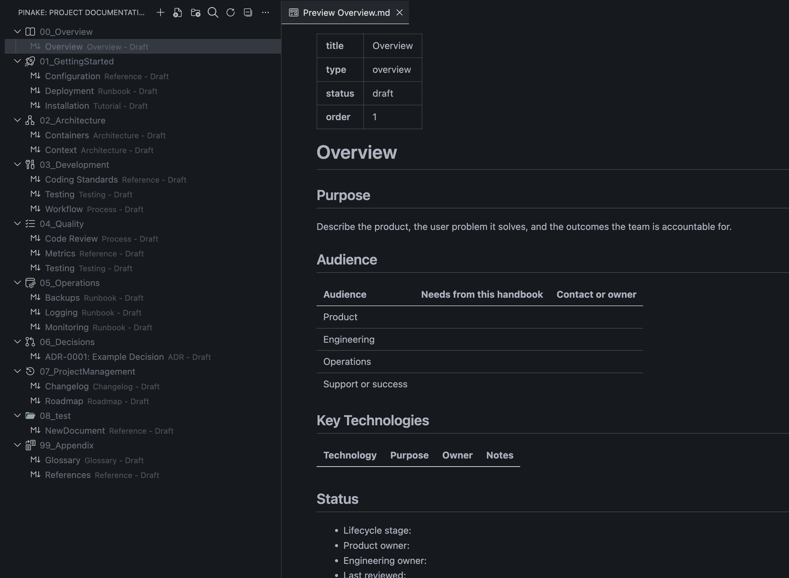
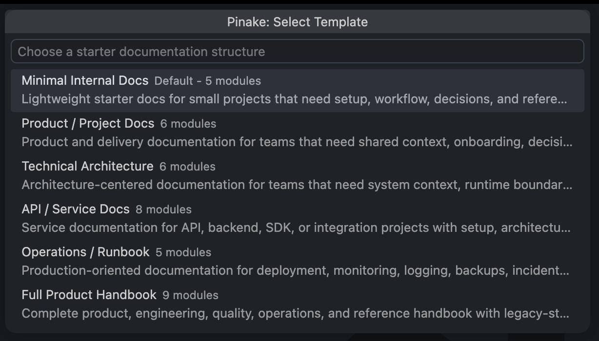

# Pinake Editor 📚

**Pinake Editor** is a local-first documentation manager built directly into VS Code. Create, organize, search, validate, import, and export project documentation without leaving your editor.

Unlike cloud documentation tools, **Pinake Editor keeps your project knowledge inside your workspace**. Markdown documents, manifests, indexes, and generated state stay local and reviewable.

<!-- Image slot: save the main extension screenshot at docs/assets/pinake-editor-preview.png -->

---

## ✨ Key Features

### 1. 📁 Native Documentation Explorer

Manage your documentation from a dedicated VS Code Activity Bar view:

- **Project Documentation Tree** - Browse `.pinake/docs` from a native sidebar
- **Favorites** - Keep important Markdown files pinned in a virtual Favorites group
- **Preview by Default** - Open documents in Markdown Preview with one click
- **Explicit Editing** - Use the Edit action when you want to modify the Markdown source
- **Context Actions** - Rename, duplicate, delete, reveal, copy path, show properties, and sort items

### 2. 🧱 Documentation Workspace Setup

Create a complete Pinake workspace with a guided setup flow:

- **Local `.pinake/` Folder** - Stores project documentation and metadata inside the repository
- **Manifest Source of Truth** - Tracks project metadata, modules, and document paths in `.pinake/pinake.json`
- **Template Selection** - Choose from focused documentation templates for projects, APIs, architecture, operations, and product handbooks
- **Optional Modules** - Add recommended documentation modules without bloating the initial setup
- **Explorer Visibility Control** - Optionally hide `.pinake` from the standard VS Code Explorer

### 3. 📝 Markdown-First Documentation

Keep documentation portable, editable, and easy to review:

- **Plain Markdown Files** - Human-authored content lives under `.pinake/docs`
- **Frontmatter Metadata** - Generated documents include title, type, status, and order metadata
- **Preview / Edit Split** - Read in Markdown Preview and edit source only when needed
- **New File and Folder Actions** - Create documentation directly from the Pinake sidebar
- **Safe Local Paths** - Commands reject absolute paths, `..`, and files outside the Pinake docs root

### 4. 🔎 Offline Search

Find project knowledge without relying on external services:

- **Local Indexes** - Search data is generated in `.pinake/.state/indexes.json`
- **Snippet Results** - Results include matched text, document path, tags, and headings
- **Scoped Queries** - Filter by text, `tag:<name>`, or `heading:<text>`
- **Backlink and Reference Data** - Track local references and broken Markdown links
- **No Network Required** - Search runs entirely inside the workspace

### 5. 🧩 Templates and Modules

Generate useful documentation structure quickly:

- **Minimal Internal Docs**
- **Product / Project Docs**
- **Technical Architecture**
- **API / Service Docs**
- **Operations / Runbook**
- **Full Product Handbook**
  
- **Component Modules** - Add focused docs for API, Database, Docker, Kubernetes, CI/CD, Frontend, Mobile, Authentication, GraphQL, gRPC, WebSocket, Backend, Cache, Message Queue, OAuth, IaC, Monitoring, Security, CLI, SDK, and Microservice projects

### 6. ✅ Validation and Repair

Keep documentation structure healthy over time:

- **Manifest Validation** - Checks `.pinake/pinake.json` against the expected schema
- **State Validation** - Validates generated module, UI, index, migration, and version state files
- **Markdown Checks** - Reports missing files, frontmatter drift, ADR naming issues, style warnings, and broken local links
- **Secret Hygiene Warnings** - Flags obvious sensitive content patterns without failing the whole validation run
- **Repair Workflow** - Recreates missing generated files and discovers untracked Markdown without overwriting edited documents

### 7. 🔄 Import, Export, and Upgrade

Move documentation in and out of Pinake safely:

- **Markdown Import** - Bring existing Markdown folders into `.pinake/docs/imported`
- **Static Export** - Export a reviewable bundle with `docs/`, `pinake.json`, and `index.html`
- **Legacy Upgrade** - Migrate older Pinake folders into the current `.pinake/docs` layout
- **Migration History** - Record upgrade activity in generated state
- **CI Validator Generation** - Create a standalone validator and GitHub Actions workflow when you want repository checks

### 8. 🤖 Agent Skill Support

Use Pinake with automation-friendly workflows:

- **Install Agent Skill** - Install the packaged Pinake skill into your Codex skill directory
- **Source-Backed Docs** - Agents can read and update documentation from local Markdown files
- **Reviewable Changes** - Documentation edits remain normal repository diffs
- **No External Storage** - Generated extension state stays under `.pinake/.state`

---

## 🚀 How to Use

Open the **Pinake** activity bar icon in the sidebar, or use the Command Palette (`Ctrl+Shift+P` / `Cmd+Shift+P`):

| Command                                   | Description                                            |
| ----------------------------------------- | ------------------------------------------------------ |
| `Pinake: Create Documentation`            | Create a new `.pinake` documentation workspace         |
| `Pinake: New Markdown File`               | Add a Markdown document under the selected folder      |
| `Pinake: New Folder`                      | Add a folder under the selected Pinake docs location   |
| `Pinake: Open Preview`                    | Open the selected document in Markdown Preview         |
| `Pinake: Edit`                            | Open the selected document as Markdown source          |
| `Pinake: Search Documentation`            | Search paths, headings, tags, and document text        |
| `Pinake: Generate Module`                 | Add focused starter documentation for a component      |
| `Pinake: Validate`                        | Validate the current Pinake workspace                  |
| `Pinake: Repair`                          | Recreate missing generated files and repair references |
| `Pinake: Upgrade`                         | Upgrade a legacy Pinake folder into the current layout |
| `Pinake: Import Markdown`                 | Import existing Markdown files into Pinake             |
| `Pinake: Export`                          | Export a static documentation bundle                   |
| `Pinake: Generate CI Validation Workflow` | Generate local validator tooling and GitHub Actions CI |
| `Pinake: Install Agent Skill`             | Install the bundled Pinake skill for Codex workflows   |
| `Pinake: Open Manifest`                   | Open `.pinake/pinake.json`                             |
| `Pinake: Set Tree Sort Order`             | Change how the documentation tree is sorted            |

### Keyboard Shortcuts

| Shortcut                   | Action                                 |
| -------------------------- | -------------------------------------- |
| `Ctrl+Alt+P` / `Cmd+Alt+P` | Open preview for the selected document |
| `Ctrl+Alt+E` / `Cmd+Alt+E` | Edit the selected document             |
| `Ctrl+Alt+S` / `Cmd+Alt+S` | Add or remove the selected favorite    |
| `Ctrl+Alt+R` / `Cmd+Alt+R` | Reveal the selected item in Explorer   |
| `Ctrl+Alt+C` / `Cmd+Alt+C` | Copy the selected item path            |
| `Ctrl+Alt+V` / `Cmd+Alt+V` | Validate the current Pinake workspace  |
| `Ctrl+Alt+F` / `Cmd+Alt+F` | Search Pinake documentation            |
| `F2`                       | Rename the selected document or folder |
| `Delete`                   | Delete the selected document or folder |

---

## 🛡️ Privacy

Your documentation is yours.

- **No Telemetry** - Pinake Editor does **NOT** send project documentation to external servers
- **Local Workspace Storage** - Documents, manifests, indexes, and UI state are stored inside the current workspace
- **No Account Required** - No sign-up, no cloud account, no external API keys
- **Reviewable Files** - Markdown and JSON files can be inspected before committing them
- **Generated State Isolation** - `.pinake/.gitignore` ignores `.pinake/.state/` by default

---

## 📝 License

This project is licensed under the MIT License.

---

**Happy documenting!** 📚
