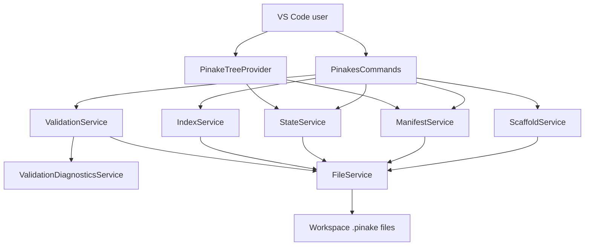
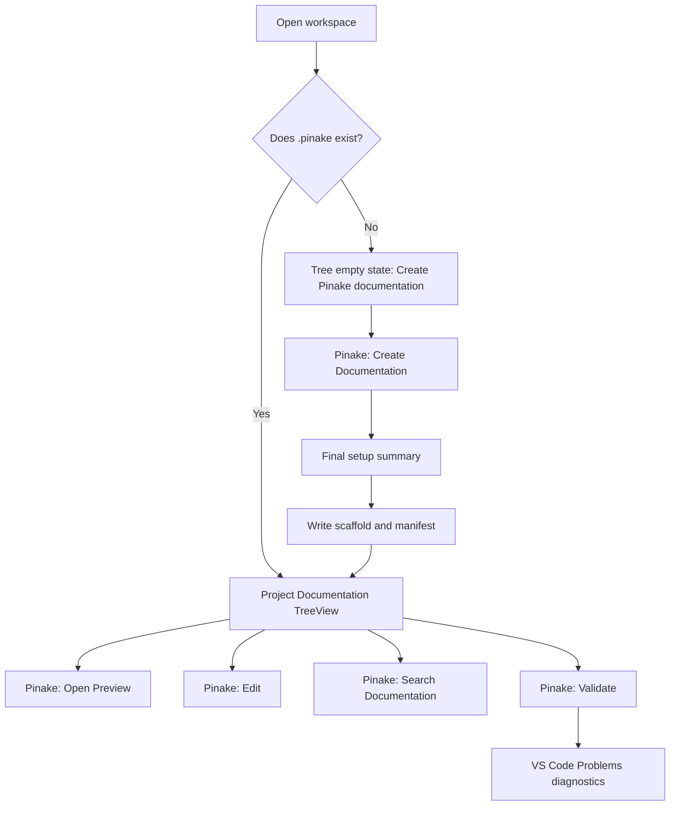

# Pinake Extension Architecture And Flows

This document describes the native VS Code extension shape, user flows, command surface, and wizard scenarios for Pinake Editor.

## Architecture Overview

Pinake Editor uses native VS Code APIs. There is no custom explorer webview for the documentation tree.

| Layer | Main files | Responsibility |
| --- | --- | --- |
| Extension activation | `src/extension.ts` | Create services, TreeView, output channel, diagnostics, watchers, and command registrations. |
| Commands | `src/commands/PinakesCommands.ts` | Own user-facing flows, prompts, confirmations, notifications, and command orchestration. |
| Tree | `src/tree/PinakeTreeProvider.ts` | Render manifest-backed docs, filesystem folders, favorites, empty states, descriptions, tooltips, and parent lookup. |
| Services | `src/services/*` | Read/write files, manifests, state, indexes, scaffolds, validation, diagnostics, and packaged skills. |
| Templates | `src/templates/*`, `src/modules/*` | Define setup templates and generated component modules. |
| Schemas | `schemas/*.schema.json` | Validate manifest and state JSON through VS Code JSON validation and runtime validation. |

## Native VS Code Identifiers

Pinake Editor contributes one Activity Bar container, `devbysergioPinakesExplorer`, and one TreeView, `devbysergioPinakesView`. These IDs are intentionally scoped to the Marketplace publisher and extension name because VS Code treats view and container IDs as global across all installed extensions.

Do not reuse the legacy IDs `pinakesExplorer` or `pinakesView` for new UI contributions. Older local VSIX builds were installed under `undefined_publisher.pinakes`; if those builds remain installed while the Marketplace build is active, shared view IDs cause VS Code to merge both extensions' `view/title` menu contributions and duplicate toolbar and overflow actions.

## UI Flow Diagram

## Wizard Scenarios

| Scenario | Expected path | Result |
| --- | --- | --- |
| Fresh workspace | Select template, modules, Explorer visibility, then confirm summary. | Creates `.pinake`, manifest, docs, state, gitignore, and optional `.vscode/settings.json`. |
| Existing `.pinake` | Existing folder warning appears before final summary. | Creates missing files and updates manifest without overwriting edited docs. |
| Legacy `Pinake/` folder | Choose copy or keep before final summary. | Copy option preserves the old folder and copies Markdown into `.pinake/docs`. |
| Multi-root workspace | Workspace picker appears first. | Selected root receives `.pinake`. |
| Cancelled summary | Choose Cancel on final summary. | No scaffold writes occur after the summary step. |

## Command Table

| Title | Command id | Surface |
| --- | --- | --- |
| Pinake: Create Documentation | `pinakes.createPinake`, `pinake.create` | Command Palette, view title |
| Pinake: Refresh | `pinakes.refresh`, `pinake.refresh` | Command Palette, view title |
| Pinake: Open Preview | `pinakes.openFile`, `pinakes.openPreview`, `pinake.openPreview` | Command Palette, item context, default file command |
| Pinake: Edit | `pinakes.openFileSide`, `pinakes.editDocument`, `pinake.editDocument` | Command Palette, item context |
| Pinake: Open Manifest | `pinakes.openManifest` | Command Palette, view title |
| Pinake: Duplicate | `pinakes.duplicate` | Command Palette, item context |
| Pinake: Reveal in Explorer | `pinakes.revealInExplorer` | Command Palette, item context |
| Pinake: Copy Relative Path | `pinakes.copyPath` | Command Palette, item context |
| Pinake: Show Properties | `pinakes.showProperties` | Command Palette, item context |
| Pinake: Set Tree Sort Order | `pinakes.sortChildren` | Command Palette, view title, folder context |
| Pinake: Add to Favorites | `pinakes.addFavorite` | Command Palette, document context |
| Pinake: Remove from Favorites | `pinakes.removeFavorite` | Command Palette, favorite context |
| Pinake: New Markdown File | `pinakes.newFile` | Command Palette, view title, folder context |
| Pinake: New Folder | `pinakes.newFolder` | Command Palette, view title, folder context |
| Pinake: Rename | `pinakes.rename` | Command Palette, item context, `F2` |
| Pinake: Delete | `pinakes.delete` | Command Palette, item context, `Delete` |
| Pinake: Generate Module | `pinakes.generateModule` | Command Palette, view title |
| Pinake: Search Documentation | `pinakes.searchDocumentation` | Command Palette, view title, keyboard |
| Pinake: Repair | `pinakes.repair` | Command Palette, view title |
| Pinake: Upgrade | `pinakes.upgrade` | Command Palette, view title |
| Pinake: Generate CI Validation Workflow | `pinakes.generateCiValidation` | Command Palette, view title |
| Pinake: Export | `pinakes.export` | Command Palette, view title |
| Pinake: Import Markdown | `pinakes.import` | Command Palette, view title |
| Pinake: Validate | `pinakes.validate` | Command Palette, view title, keyboard |
| Pinake: Install Agent Skill | `pinakes.installAgentSkill` | Command Palette, view title |

## Keybindings

| Key | macOS | Command |
| --- | --- | --- |
| `Ctrl+Alt+P` | `Cmd+Alt+P` | Open preview |
| `Ctrl+Alt+E` | `Cmd+Alt+E` | Edit document |
| `Ctrl+Alt+S` | `Cmd+Alt+S` | Add/remove favorite |
| `Ctrl+Alt+R` | `Cmd+Alt+R` | Reveal in Explorer |
| `Ctrl+Alt+C` | `Cmd+Alt+C` | Copy relative path |
| `Ctrl+Alt+V` | `Cmd+Alt+V` | Validate |
| `Ctrl+Alt+F` | `Cmd+Alt+F` | Search documentation |
| `F2` | `F2` | Rename selected tree item |
| `Delete` | `Delete` | Delete selected tree item |

## Native Surface Rules

- Prefer TreeView, QuickPick, InputBox, output channels, diagnostics, and Markdown preview.
- Keep setup and destructive actions behind explicit prompts.
- Keep `.pinake` hidden from Explorer only when the user chooses that setup option.
- Keep command IDs stable even when user-facing command titles change.
- Do not put secrets or production credential values in Pinake docs.
